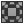
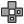

[Nuke Icons](#Nuke-Icons) | [Classes](#Classes)

# Nuke Icons

| IMG | Filename |
| :---: | :--- |
||2D|
||2DMasked|
||3D|
||Add|
||Add32|
||AddMix|
||AddTimeCode|
||AdjBBox|
||Anaglyph|
||AppendClip|
||Assert|
||AutoCrop|
||Axis|
||Backdrop|
||Bezier|
||Bilateral|
||BlackOutside|
||Blend|
||BlinkScript|
||Blur|
||BumpBoss|
||BurnIn|
||Camera|
||CameraShake|
||CameraTracker|
||Card|
||ChannelMerge|
||CheckerBoard|
||Clamp|
||ClipTest|
||CMSTestPattern|
||Color|
||Color3D|
||ColorAdd|
||ColorBars|
||ColorCorrect|
||ColorGamma|
||ColorLookup|
||ColorMath|
||ColorMatrix|
||ColorMult|
||ColorSpace|
||ColorTransfer|
||ColorWheel|
||CompareMetaData|
||Constant|
||ContactSheet|
||Convolve|
||CopyBBox|
||CopyMetaData|
||CopyNode|
||CopyRectangle|
||CornerPin|
||Crop|
||Crosstalk|
||Cube|
||CurveTool|
||Cylinder|
||DeepColorCorrect|
||DeepCrop|
||DeepExpression|
||DeepFromFrames|
||DeepFromImage|
||DeepHoldout|
||DeepMerge|
||DeepRead|
||DeepRecolor|
||DeepReformat|
||DeepSample|
||DeepToImage|
||DeepToPoints|
||DeepTransform|
||DeepWrite|
||Defocus|
||DegrainBlue|
||DegrainSimple|
||denoise|
||DepthGenerator|
||DepthToPoints|
||DepthToPosition|
||Difference|
||DifferenceKeyer|
||DirBlur|
||DirectLight|
||DiskCache|
||Dissolve|
||Dither|
||Dot|
||DropShadow|
||DustBust|
||EdgeBlur|
||EdgeDetect|
||Emboss|
||EnvironMaps|
||Environment|
||ErodeBlur|
||ErodeFast|
||Exposure|
||Expression|
||filter|
||FilterErod|
||FilterErode|
||Flare|
||FloodFill|
||Fog|
||FrameBlend|
||FrameHold|
||FrameRange|
||GenerateLUT|
||Geometry|
||Glint|
||Glow|
||GodRays|
||Grade|
||Grain|
||Grid|
||GridWarp|
||Group|
||HistEQ|
||Histogram|
||HSVTool|
||HueCorrect|
||HueKeyer|
||HueShift|
||IBKColour|
||IBKGizmo|
||IDistort|
||ImageModeler|
||Input|
||Invert|
||JoinViews|
||Keyer|
||KeyerLuminance|
||Keylight|
||Keymix|
||Laplacian|
||LayerChannel|
||LayerContactSheet|
||LensDistort|
||LevelSet|
||Light|
||LightWrap|
||Log2Lin|
||Log2Lin2|
||MarkerRemoval|
||MatchGrade|
||Matrix|
||Median|
||Merge|
||MergeDifference|
||MergeExpression|
||MergeIn|
||MergeMatte|
||MergeMax|
||MergeMin|
||MergeMultiply|
||MergeOut|
||MergePlus|
||MergeScreen|
||MetaData|
||MinColor|
||Mirror|
||MixViews|
||Modeler|
||Modify|
||ModifyMetaData|
||MotionBlur2D|
||MotionBlur3D|
||Noise|
||NoOp|
||NoTimeBlur|
||OCIO|
||Oflow|
||OneView|
||Output|
||Paint|
||particle_settings|
||ParticleBounce|
||ParticleCache|
||ParticleCurve|
||ParticleDirectionalForce|
||ParticleDrag|
||ParticleEmitter|
||ParticleExpression|
||ParticleGravity|
||ParticleLookAt|
||ParticleMerge|
||ParticleMotionAlign|
||ParticlePointForce|
||Particles|
||ParticleSpawn|
||ParticleSpeedLimit|
||ParticleToGeo|
||ParticleTurbulence|
||ParticleVortex|
||ParticleWind|
||planar_tracker|
||PointCloudGenerator|
||PointCloudMesh|
||PointLight|
||PointsTo3D|
||PointTo3D|
||PoissonMesh|
||Position|
||PositionToPoints|
||PostageStamp|
||Posterize|
||pPointCloud|
||Precomp|
||Premult|
||PremultByColor|
||Primatte|
||ProjectionSolver|
||Radial|
||Ramp|
||Read|
||ReadGeo|
||Reconcile3D|
||ReConverge|
||Rectangle|
||Reformat|
||ReLight|
||Remove|
||Remove32|
||Render|
||RenderMan|
||RenderManShader|
||Retime|
||RolloffContrast|
||Roto|
||RotoPaint|
||Sampler|
||Saturation|
||ScannedGrain|
||Scene|
||Shader|
||Shaders|
||Sharpen|
||Shuffle|
||ShuffleCopy|
||ShuffleViews|
||SideBySide|
||SoftClip|
||Soften|
||Spark|
||Sparkles|
||Sphere|
||SplineWarp|
||SplitAndJoin|
||SpotLight|
||Stabilize|
||StickyNote|
||STMap|
||Switch|
||TabScriptEditor|
||TargetCamera|
||TemporalMedian|
||Text|
||Tile|
||Time|
||TimeBlur|
||TimeClip|
||TimeDissolve|
||TimeEcho|
||TimeOffset|
||TimeWarp|
||Toe|
||Tracker|
||Transform|
||Truelight|
||TVIScale|
||UltBrush|
||UltColorPicker|
||UltEraser|
||Ultimatte|
||Unpremult|
||VectorBlur|
||Vectorfield|
||VectorGenerator|
||Viewer|
||ViewMetaData|
||VolumeRays|
||Write|
||WriteGeo|
||ZBlur|
||ZMerge|
||ZSlice|

# Classes

Node name | Class name
------ | ------
**Axis** | Axis2
**Backdrop** | BackdropNode
**Blur** | Blur
**Camera** | Camera2
**Card** | Card2
**ColorCorrect** | ColorCorrect
**ColorLookup** | ColorLookup
**Colorspace** | Colorspace
**Constant** | Constant
**Copy** | Copy
**CornerPin2D** | CornerPin2D
**Crop** | Crop
**Cube** | Cube
**DeepCrop** | DeepCrop
**DeepExpression** | DeepExpression
**DeepHoldout** | DeepHoldout2
**DeepMerge** | DeepMerge
**DeepRecolor** | DeepRecolor
**DeepReformat** | DeepReformat
**Dilate** | Dilate
**Dissolve** | Dissolve
**Exposure** | EXPTool
**FrameHold** | FrameHold
**FrameRange** | FrameRange
**Grade** | Grade
**Group** | Group
**IBKColour** | IBKColourV3
**IBKGizmo** | IBKGizmoV3
**IDistort** | IDistort
**Input** | Input
**Invert** | Invert
**Keyer** | Keyer
**Keylight** | OFXuk.co.thefoundry.keylight.keylight_v201
**Keymix** | Keymix
**Log2Lin** | Log2Lin
**Merge** | Merge2
**Mirror** | Mirror2
**Multiply** | Multiply
**NoOp** | NoOp
**Noise** | Noise
**OCIOColorSpace** | OCIOColorSpace
**Output** | Output
**Primatte** | Primatte3
**Project3D** | Project3D2
**Radial** | Radial
**Ramp** | Ramp
**Read** | Read
**Reformat** | Reformat
**Retime** | Retime
**Roto** | Roto
**RotoPaint** | RotoPaint
**STMap** | STMap
**Saturation** | Saturation
**ScanlineRender** | ScanlineRender
**Scene** | Scene
**Shuffle** | Shuffle
**ShuffleCopy** | ShuffleCopy
**Sphere** | Sphere
**StickyNote** | StickyNote
**TimeWarp** | TimeWarp
**Tracker** | Tracker4
**Transform** | Transform
**Viewer** | Viewer
**Write** | Write
**ZDefocus** | ZDefocus2
